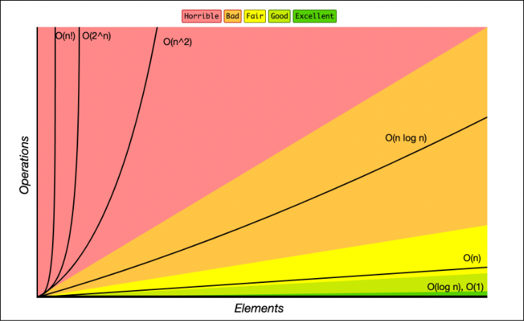

categorized algo's time or memory requirements based on input. not an exact measurement. wont indicate how many CPU cycles it takes, but to generalize growth of the algorithm.

O(N) - linear growth based on input

In the real world - 
memory growth is not computationally free, but in the matter of thinking about algorithms we don't think about that.

languages like Golang or JavaScript even heavier penalties are paid because memory is kept around and frows faster causing complete halts in the program for clean up.

```
function sum_char_codes(n: string): number {
	let sum = 0;
	for (let i = 0; i < n.length; ++i) {
		sum += n.charCodeAt(i);
	}
	return sum;
}
```

O(N) time complexity above 

loop has to execute the length of the string, so if the string grows by 50% then our function is %50 slower. 

```
function sum_char_code(n: string): number {
	let sum = 0;
	for (let i = 0; i< n.length; ++i) {
		sum += n.charCodeAt(i);
	}
	
	for (let i = 0; i < n.length; ++i) {
		sum += n.charCodeAt(i);
	}
	return sum
}
```

constants are dropped because big O is meant to describe to upper bound of the algorithm, the constant becomes irrelevant. 

`N = 1, O(10N) = 10, O(N^2) = 1`

`N = 5, O(10N) = 50, O(N^2) = 25`

`N =100, O(10N) = 1000, O(N^2) = 10,000 // 10x bigger`

`N = 1000, O(10N) = 10,000, O(N^2) = 1,000,000 // 100x bigger`

`N = 10000, O(10N) = 100,000, O(N^2) = 100,000,000 // 1000x bigger`

```
function sum_char_codes(n: string): number {
	let sum = 0;
	 for (let i = 0; i < n.length; ++i) {
		 const charCode = n.charCodeAt(i);
		 //capital E
		 if (charCode === 69) {
			 return sum;
		 }
		 sum += charCode;
	 }
	 return sum;
}
```

O(N)

E = 69
Therefore any string with E in it will terminate early (unless it is the last item in the list).
ITS STILL O(N)

Important

1. growth is with respect to input 

2. constants are dropped

3. worst case is usually the way we measure


		


	last two are algorithm's that can't run on traditional computers. maybe on quantum computers?

	would take thousands of years

	can't solve the traveling salesman for 12 cities

	O(N^2) 
	
	```
	 function sum_char_codes(n: string): number {
		 let sum = 0;
		 for (let i = 0;  i < n.length; ++i) {
			 for(let j = 0; j < n.length; ++j) {
				 sum += charCode;
			 }
		 }
			return sum;
	 }
	 ```
	
	O(N^3)
	
	```
	function sum_char_codes(n: string): number {
		let sum = 0;
		for (let i = 0; i < n.length; ++i) {
			for (let j = 0; j < n.length; ++j) {
			 for (let k = 0; k < n.length; ++k) {
				 sum += charCode;
			 }
			}
		}
			return sum;
	}
	```

O(n log n)

-Quicksort 

O(long n)

-Binary search trees

multiple ways to measure complexity

space growth:
```
return <Component
				  . . . props/>

```

people that do the above don't care about space or time.
